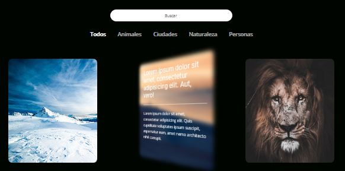
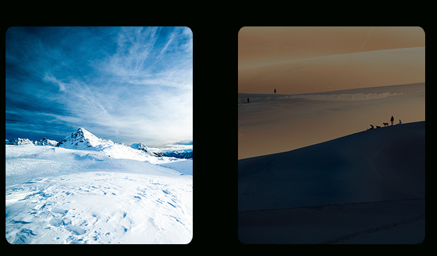

# 3D Photos Gallery 🌙 

Just HTML CSS and JS 😊

## OPS...

I did the site in my native language (Spanish) so... if you want it use the search bar in English you will have to change the classes in the div containers. 

## Visual Effects

A kind of 3d twist, for me it pretty cool

For some reason in mobiles devices the 3d twist doesn't work well, so with media queries I change de opacity with a hover effect for mobiles.

## Search bar

A normal filter, alse you can filter images with the categories selector.
The filters are just worlds in the div's class for each image

# Oh, thanks!
If you'd like to [say thanks](https://saythanks.io/to/JoacoViera) 😊

Thanks to [Pixabay](https://pixabay.com) for the photos !

## Hope you like it!

#### Joaquín